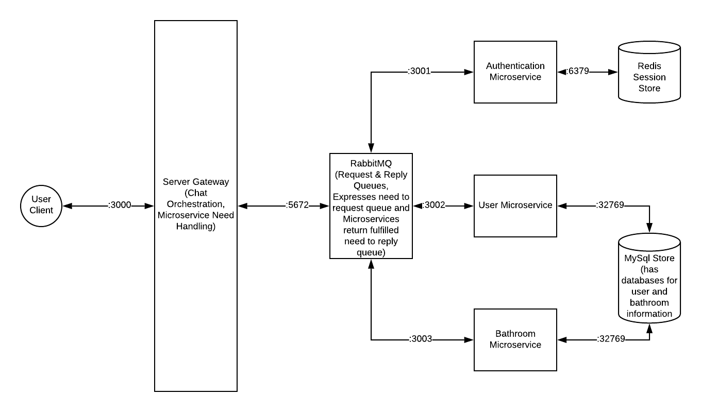
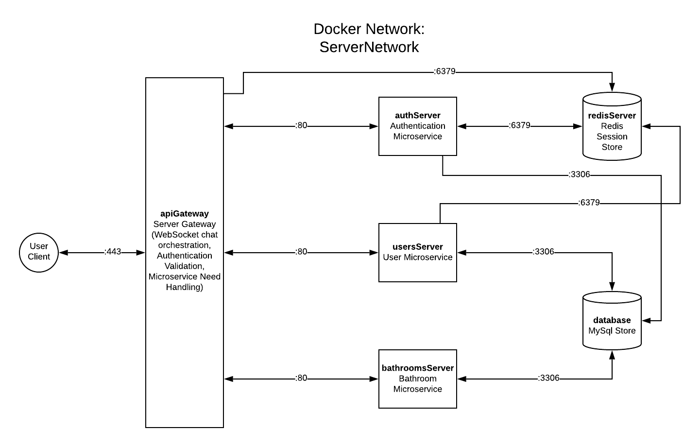

# GroupPoop

## Project Description

The target audience for GroupPoop are primarily the **students and faculty** at the **University of Washington**, though in the future we hope this to be scaled to a wider audience. 

We envision this population to use our application to find the best pit stops on campus. This application could be applied to anyone visiting the University of Washington, but we will be focusing on students and faculty because they are the predominant population on campus.

Our audience seeks to use GroupPoop to achieve the satisfying, entertaining break that they deserve. Bathrooms and their locations on campus will be stored in our database and each will have a rating based on ambience, cleanliness, toilet paper quality, etc. Users will also be able to join chats with others in the process of going about their business. With GroupPoop, users will truly feel like royalty on the porcelain throne.

Most of us, if not all of us, have had some uncomfortable situations when needing to use the restroom on campus. There is an inequality that exists between buildings and their bathrooms, and we want people to have the most comfortable experience when they need to relieve themselves. GroupPoop can make that happen.

<br>

## Technical Specifications

### Initial Architectural Diagram
The system we create will implement a microservices architecture. All requests from users get handled by the Gateway layer server, which then creates needs and puts them onto the RabbitMQ request queue. Microservices will be subscribed to the request queue and if they can fulfill a need, they will, and then will return the fulfilled need onto the reply queue, which the gateway layer then receives and processes. The Redis store and MySQL store will be accessible via microservices.



### Final Architectural Diagram
Here is our final architecture diagram. As you can see we got rid of RabbitMQ handling microservices and our API gateway now functions as a reverse proxy.



### User Stories

| #   | Priority | User      | Issue |
| --- | -------- | --------- | ----- |
| 1   | P0       | As a user | I want to get the information about a bathroom on campus |
| 2   | P0       | As a user | I want to chat with someone while going about my business |
| 3   | P0       | As a user | I want to create an account and log in |
| 4   | P1       | As a user | I want to review a bathroom on campus |
| 5   | P1       | As a user | I want to make a list of my favorite bathrooms |
| 6   | P2       | As a user | I want to edit a review |
| 7   | P2       | As a user | I want to delete a review |

<br>

| #   | Solution to Issue |
| --- | -------- |
| 1   | To get information about a bathroom on campus, make a **GET request** at `/bathroom/:bathroomID`. Upon receiving the request, the server will attempt to fetch data from the **MySQL database** using a **SELECT statement** and return the bathroom information encoded as JSON if successful. |
| 2   | To chat with someone, a user must utilize a websocket with the `/chat` endpoint connection to connect with other users who are logged in. |
| 3   | To create an account, a user must make a **POST request** at `/users/:userID`. Upon receiving the request, add a new user to the **MySQL database** using an **INSERT statement** and the provided credentials. |
| 4   | To review a bathroom on campus, make a **POST request** at `/bathroom/:bathroomID/review`. Upon receiving the request, the server will create a new **INSERT statement** using the information prvided to add to the **MySQL database**.|
| 5   | To add a bathroom to the list of favorite bathrooms, make a **POST request** at `/favorites/:bathroomID`. Upon receiving the request, the server will update the user information in the **MySQL database** to include a list of bathrooms. |
| 6   | To edit a review of a bathroom make a **PATCH request** at `/review/:reviewID`. Upon receiving the request, the server will update a review from the **MySQL database** that matches the given information. |
| 7   | To delete a review of a bathroom make a **DELETE request** at `/review/:reviewID`. Upon receiving the request, the server will delete a review from the **MySQL database** that matches the given information. |

### Endpoints

`/login`:

- `POST`: `application/json`: Log in user and returns session token.
	- `200`: `application/json`: Successfully logs in user; returns session token in `Authorization` header.
  - `401`: Cannot authenticate provided credentials.
  - `415`: Cannot decode body / received unsupported body.
  - `500`: Internal server error.

`/login/:userID`:
- `DELETE`: Log out a user.
  - `200`: Successfully logs out user. 
  - `401`: Cannot verify session token or no session token. 
  - `500`: Internal server error.

<br>

`/user`:

- `POST`: `application/json`: Create a new user.
	- `201`; `application/json`: Successfully creates a new user, returns encoded user model in body. 
	- `401`: Cannot verify session token or no session token.  
	- `415`: Cannot decode body / received unsupported body. 
	- `500`: Internal server error. 


`/user/:userID`:

- `GET`: Get user information, including reviews.
	- `200`; `application/json`: Succesfully retrieves user information, returns encoded user model in body.
	- `401`: Cannot verify session token or no session token.
	- `500`: Internal server error.
- `PATCH`: `application/json`: Update first and / or last name for user.
	- `200`; `application/json`: Successfully first and / or last name password for user. 
	- `401`: Cannot verify session token or no session token. 
	- `415`: Cannot decode body / received unsupported body. 
	- `500`: Internal server error. 
- `DELETE`: Delete a user.
	- `200`: Successfully deletes user. 
	- `401`: Cannot verify session token or no session token. 
	- `500`: Internal server error. 

<br>

`/review/:reviewID`: 

- `PATCH`: `application/json`: Update review.
	- `200`; `application/json`: Successfully updates review. 
	- `401`: Cannot verify session token or no session token. 
	- `403`: Review does not exist. 
	- `500`: Internal server error. 
- `DELETE`: Delete a review.
	- `200`: Successfully deletes review. 
	- `401`: Cannot verify session token or no session token. 
  - `403`: Review does not exist. 
	- `500`: Internal server error. 

<br>

`/bathroom`: 

- `GET`: Get all bathrooms information
	- `200`: `application/json`: Succesfully retrieves bathrooms information, returns encoded review model in body. 
	- `401`: Cannot verify session token or no session token. 
	- `500`: Internal server error.

`/bathroom/:bathroomID`: 

- `GET`: Get a specific bathroom's information
	- `200`: `application/json`: Succesfully retrieves a bathroom's information, returns encoded review model in body. 
	- `401`: Cannot verify session token or no session token. 
	- `500`: Internal server error.

`/bathroom/:bathroomID/review`: 

- `POST`: `application/json`: Create a new review.
	- `201`: `application/json`: Successfully creates a new review, returns encoded review model in body. 
	- `401`: Cannot verify session token or no session token. 
	- `415`: Cannot decode body / received unsupported body. 
	- `500`: Internal server error.  

<br>

`/favorites`:

- `GET`: Get all favorites information for a given user.
	- `200`: `application/json`: Succesfully retrieves favorites information, returns encoded review model in body. 
	- `401`: Cannot verify session token or no session token. 
	- `500`: Internal server error.


`/favorites/:bathroomID`:

- `POST`: Add a favorite for a given user.
	- `201`: `application/json`: Succesfully creates a new favorites.
  - `304`: Favorites not modified, favorite already added.
	- `401`: Cannot verify session token or no session token. 
	- `500`: Internal server error.

<br>

`/chat`:

- Websocket connection for users to chat with each other.
- User is required to connect with session token otherwise they are not logged in.


### Models

We will be using MySql as our persistent data store.

`tblUser`: Keeps track of user information. 

```
CREATE TABLE IF NOT EXISTS tblUser (
  ID INT NOT NULL AUTO_INCREMENT PRIMARY KEY,
  Email VARCHAR(512) NOT NULL UNIQUE,
  UserName VARCHAR(256) NOT NULL UNIQUE,
  PassHash VARCHAR(128) NOT NULL,
  FirstName VARCHAR(128) NOT NULL,
  LastName VARCHAR(128) NOT NULL,
  PhotoURL VARCHAR(512) NOT NULL,
  INDEX (Email, UserName)
);
```

<br>

`tblBathroom`: Keeps track of information relating to a bathroom. 
```
CREATE TABLE IF NOT EXISTS tblBathroom (
  ID INT NOT NULL AUTO_INCREMENT PRIMARY KEY,
  Name VARCHAR(256) NOT NULL,
  Description VARCHAR(512) NOT NULL,
  Location VARCHAR(128) NOT NULL,
  Gender VARCHAR(128) NOT NULL,
  NumSinks INT NOT NULL,
  NumToilets INT NOT NULL,
  NumUrinals INT NOT NULL,
  NumTrashCans INT NOT NULL,
  NumAirDryers INT NOT NULL,
  NumTowelDispensers INT NOT NULL
);
```

<br>

`tblReview`: Keeps track of review a user makes for a bathroom. 
```
CREATE TABLE IF NOT EXISTS tblReview (
  ID INT NOT NULL AUTO_INCREMENT PRIMARY KEY,
  UserID INT NOT NULL,
  FOREIGN KEY (UserID) REFERENCES tblUser(ID) ON DELETE CASCADE,
  BathroomID INT NOT NULL,
  FOREIGN KEY (BathroomID) REFERENCES tblBathroom(ID) ON DELETE CASCADE,
  Score INT NOT NULL,
  Content VARCHAR(512) NOT NULL,
  CreatedAt DATETIME NOT NULL,
  EditedAt DATETIME NOT NULL
);
```

<br>

`tblFavorites`: Keeps track of a user's favorites
```
CREATE TABLE IF NOT EXISTS tblFavorites (
  ID INT NOT NULL AUTO_INCREMENT PRIMARY KEY,
  UserID INT NOT NULL,
  FOREIGN KEY (UserID) REFERENCES tblUser(ID) ON DELETE CASCADE,
  BathroomID INT NOT NULL,
  FOREIGN KEY (BathroomID) REFERENCES tblBathroom(ID) ON DELETE CASCADE
);
```

<br>


